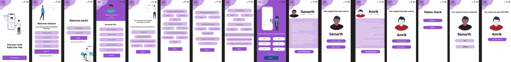
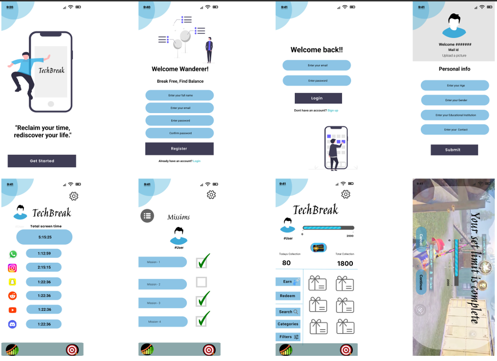

# 🎨UI Design Showcase

This repo contains Figma designs of two innovative app projects — crafted with user-centric thinking and clean UI principles.

---

## 🧠 Projects Included

---

### 🔹 Hello Mate – Student Life Enhancement Platform

**Hello Mate** is a smart roommate-matching platform tailored for students. It enhances campus living by helping users find compatible roommates through a personality-based quiz system.

- 📌 Purpose: Reduce roommate conflicts and improve shared living experiences in student housing.
- 🧠 How it Works: Users take a lifestyle/personality quiz → system scores compatibility → best matches shown in dashboard.
- 💡 Features:
  - Dynamic quiz UI
  - Real-time compatibility scoring
  - Match suggestions screen
- 🎯 Impact: Enables smoother roommate selection based on mutual habits and values, improving overall student life.

> 🔗 [View on Figma](https://www.figma.com/proto/Ue1LQ4Uh9cMzEh1i25d2fj/Hello-Mate--?node-id=0-1&t=z19RP4MQz6o4ThJm-1)  
> 📥 [Download .fig File](./HelloMate.fig)

#### 🖼️ Preview

---

### 🔹 TechBreak – Digital Wellness & Reward Platform

**TechBreak** is a screen-time reduction app that helps users build healthier digital habits by rewarding them for staying off distracting apps.

- 📌 Purpose: Combat phone addiction by gamifying screen-time control and turning mindful breaks into rewards.
- 🔒 Core Mechanism:
  - Users can **lock selected apps** for a desired break duration.
  - If they successfully stay off the app, they **earn points**.
  - Points can be claimed for rewards (like vouchers, shoutouts, or perks).
- 🛠️ Key Features:
  - App usage tracker (tracks how long an app is used)
  - Lock timer with push notification when time ends
  - Reward system with claimable points
- 🎯 Impact: Helps users take intentional breaks from screens and feel motivated to control their app usage, especially among students or digital workers.

> 🔗 [View on Figma](https://www.figma.com/proto/DChCv4c9ygsEziqkJTixLA/-TechBreak?node-id=0-1&t=k0nSu0qZvydOxUoe-1)  
> 📥 [Download .fig File](./TechBreak.fig)

#### 🖼️ Preview

---

## 📝 Figma Links Backup

For convenience or offline sharing:  
📄 [figma_links.txt](./figma_links.txt)

